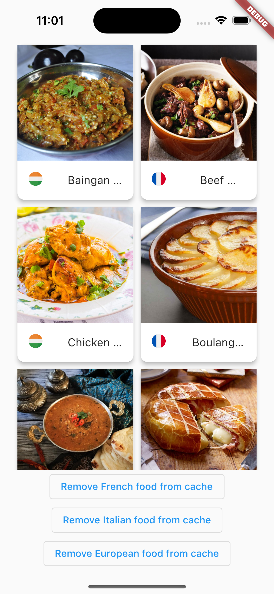
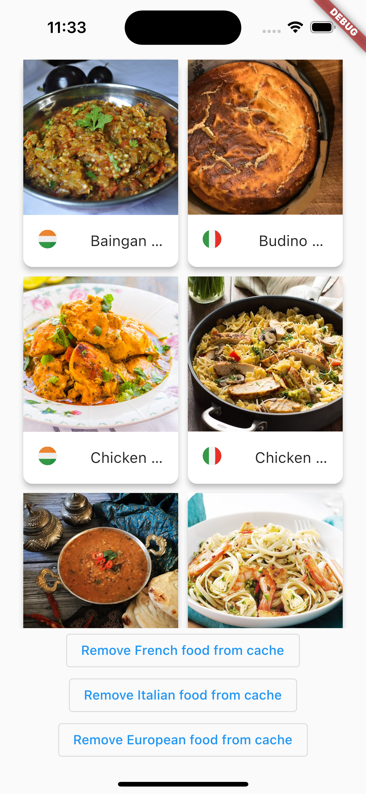
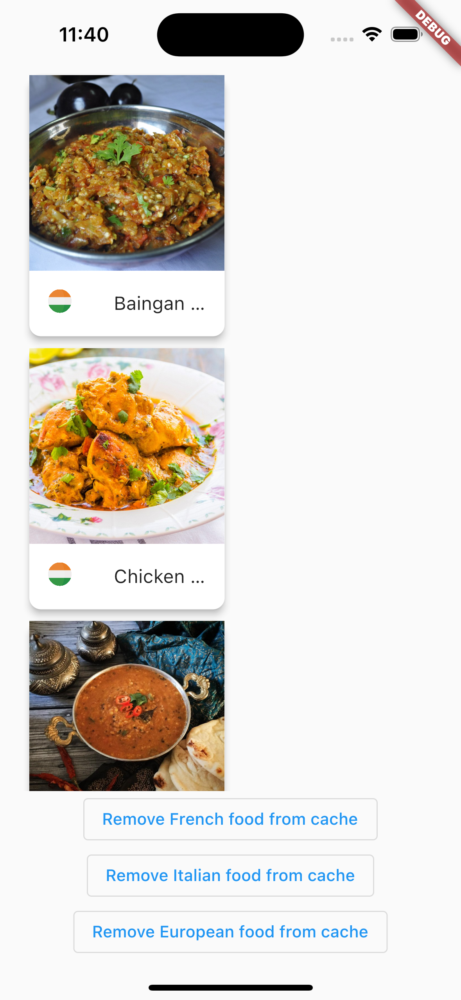

<div align="center">

# flutter_cache_strategy 

<strong>A package to implement a complete caching strategy to handle the display of data for your users.</strong>

</div>

## Requirements 🖇️

Dart sdk: ">=2.17.6 <3.0.0"
Flutter: ">=3.3.8"

## Usage ⚒️

You can refer to the `example` folder to know how to implement the 
package. 

First you need to inject the `CacheStrategyPackage()` (it's a Singleton)

Then, you can call `execute()` method and inject the parameters required depending on the strategy choosen (`boxeName`,`async`, `serializer`...)

You can use 4 differents strategies : 

- **AsyncOrCacheStrategy** which will first trigger a remote call to retrieve the data and store it in the device's cache. If the call generates an error at any point, the data in the cache will be retrieved.
- **CacheOrAsyncStrategy** works in reverse to the above strategy, looking for cached data first and if null is returned then a remote call is triggered. 

- **JustAsyncStrategy** will only trigger a remote call to retrieve data.

- **JustCacheStrategy** will only fetch cached data.

<br>

```dart
    final _provider = FetchDataImpl();
    final _package = CacheStrategyPackage();
    
    final List<MealDto>? frenchFood = await _package
            .execute<List<MealDto>>(
        keyCache: "frenchFood",
        boxeName: "EuropeanBoxe",
        serializer: (data) => MealDto.fromData(data),
        async: _provider.getFrenchFood(),
        strategy: AsyncOrCacheStrategy(),
        isEncrypted: true,
        )
            .onError((error, stackTrace) {
        throw error ?? Error();
        });
```

I advise to implement the package in your repository. Its role is to convert the dto into an entity, so handling data caching here seems relevant.

And that's all ! 

## Example 📱

- <ins>When it's set on AsyncOrCacheStrategy :</ins> 
<br>

<br>
- <ins>Now turn off the internet and pull down to refresh the lists, you'll still see the meals :</ins>
<br>

<br>
- <ins>Now click on Remove French food from cache :</ins> 
<br>

<br>
You can see now that the French food has been removed from the cache but the Italian food is still there.
<br>
- <ins>Now if you click on Remove European food from cache :</ins>
<br>
<br>
There are no more European meals as this box has been cleaned of the cache but the Indian meals are still present as they are stored in a different box. 

## Articles / Resources 📚

This package is the completion of that [article](https://medium.com/@romaingreaume/implementing-a-cache-strategy-in-your-flutter-app-5db3e316e7c9) who I wrote. 
## Pull requests ⬇️
Pull requests are welcome, I'm a beginner so don't hesitate if you see any corrections.


## Additional information 

- https://github.com/romgrm/flutter_cache_strategy
